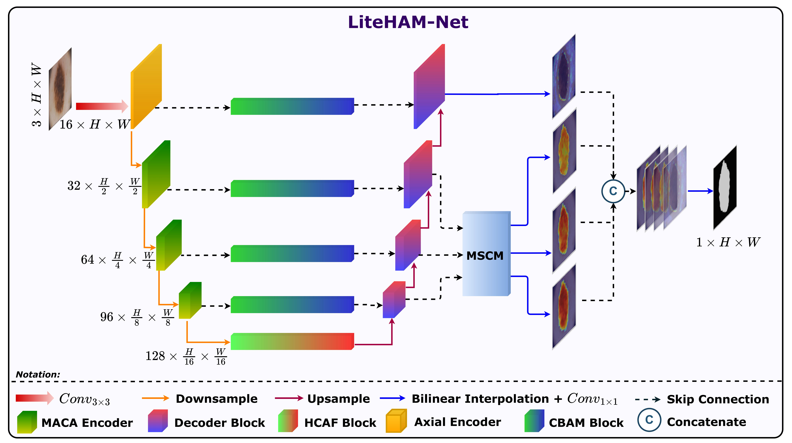
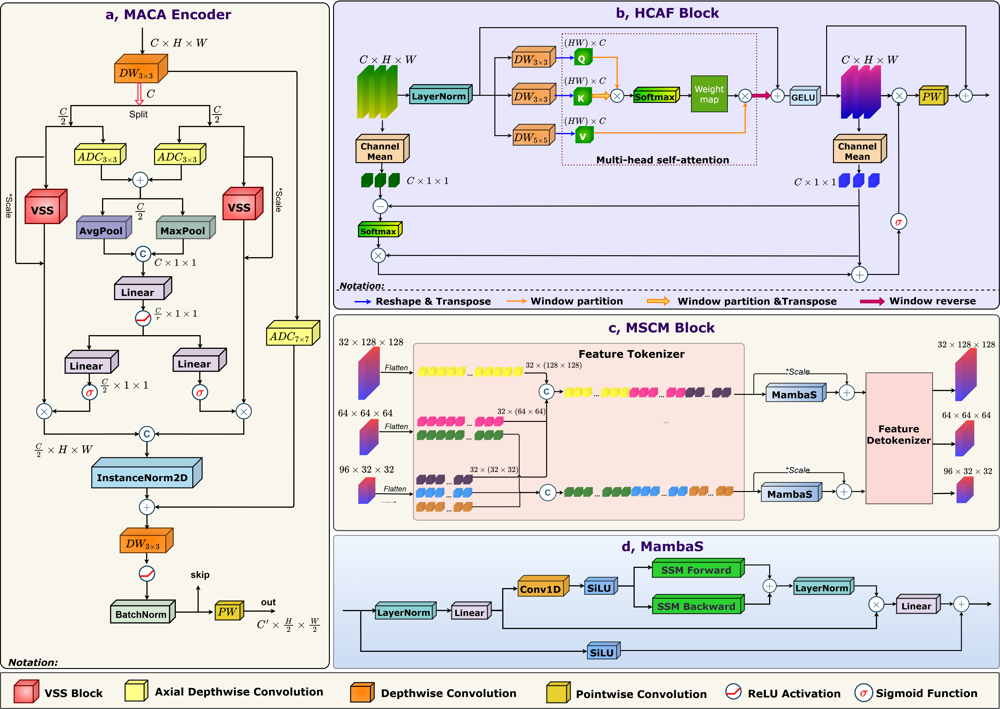
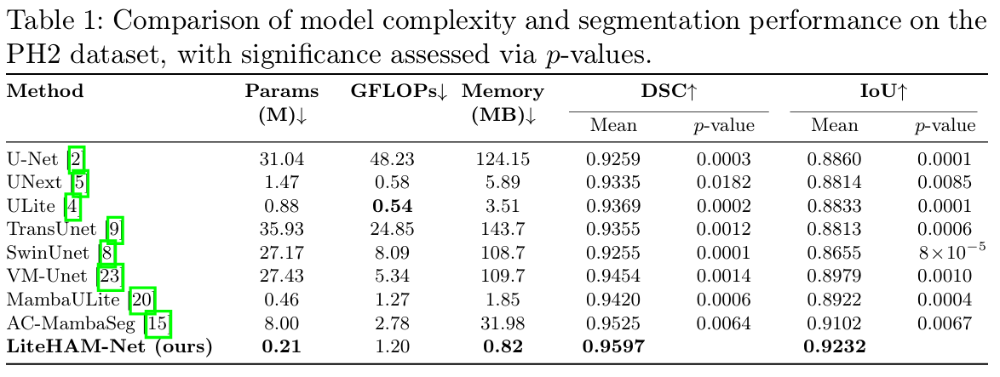
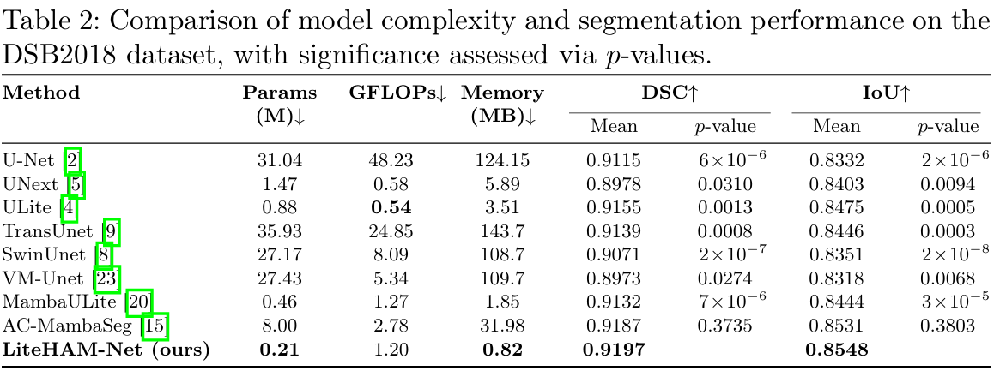
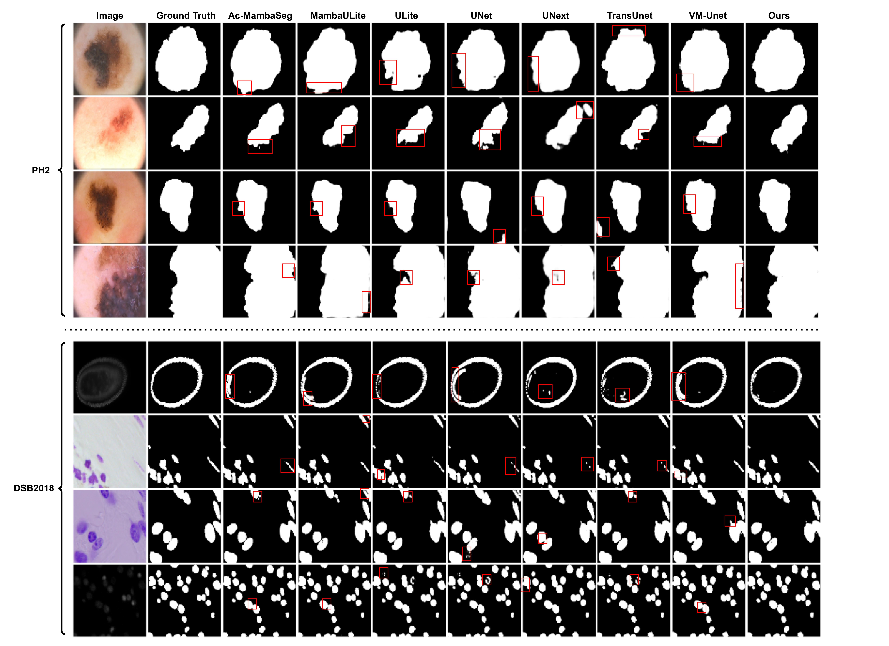

<h1 align="center">
  Towards Real-Time Medical Image Segmentation via Axial Channel Attention and Multi-Scale Contextual Mamba
</h1>

<p align="center">
  <b>Quang-Huy Nguyen</b><sup>1</sup>, 
  Van Quang Nguyen<sup>1</sup>, 
  Van-Truong Pham<sup>1</sup>, 
  Thi-Thao Tran<sup>1*</sup>
</p>

<p align="center">
  <sup>1</sup>Hanoi University of Science and Technology, Vietnam
</p>

<p align="center">
  *Corresponding author
</p>
<p align="center">
  <a href="https://doi.org/10.1007/978-3-032-18162-6_10">
    
  </a>
  
  
  
  
  
  
</p>

---


## 🧠 Abstract

The rapid advancement of handheld medical devices has in creased the demand for accurate yet lightweight medical image segmen tation models. While current CNN and Transformer architectures are effective, they often struggle to balance global context modeling with computational efficiency, a critical factor for deployment on resource constrained devices. Recently, the Mamba architecture, based on the State Space Model (SSM), has emerged as a promising approach for capturinglong-range dependencies with linear computational complexity. Motivated by this potential, we present LiteHAM-Net, an ultra lightweight U-Net variant featuring only 0.21M parameters and approx imately 1 GFLOP of computational cost. The model incorporates two primary novel Mamba-based modules: the Mamba Axial Channel Attention (MACA) Encoder and the Multi-scale Contextual Mamba (MSCM) Block. These modules collaboratively extract rich semantic features by effectively leveraging global and multi-scale information. Furthermore, we introduce a Hybrid Convolution Attention Fusion (HCAF) block at the bottleneck to effectively refine features while keeping the model lightweight. Results from extensive experiments on the PH2 and DSB datasets indicate that LiteHAM-Net not only substantially reduces computational resource requirements but also surpasses existing lightweight models in segmentation accuracy. These findings underscore the potential of hybrid architectures combining Mamba, convolution, and attention mechanisms for real-time medical image segmentation applications.

---

## ⭐ Key Contributions

* Ultra-lightweight model: **0.21M params, ~1 GFLOP**
* Novel Mamba modules (**MACA, MSCM**) for global & multi-scale modeling
* Efficient **HCAF** block for feature refinement
* Superior performance on **PH2** and **DSB2018** with lower cost

---

## 🏗️ Architecture Overview



*Figure 1. Overall architecture of LiteHAM-Net.*

---

## ⚙️ Core Components



*Figure 2. Key modules: MACA, MSCM, and HCAF.*

---

## 📊 Datasets

### 🔬 PH² (Dermoscopic Skin Lesions)
A curated dataset of 200 dermoscopic images with pixel-wise lesion annotations, widely used for skin lesion segmentation.

**Access**  
👉 https://www.fc.up.pt/addi/ph2%20database.html

---

### 🧬 Data Science Bowl 2018 (Cell Nuclei Segmentation)
A large-scale benchmark for nuclei segmentation across diverse imaging conditions.

**Access**  
👉 https://www.kaggle.com/competitions/data-science-bowl-2018/data

---

## 📈 Results




---

## 🖼️ Visualization



*Figure 3. Qualitative comparison on PH2 and DSB2018 datasets.*

---

## 📚 Citation

If you find this work useful, please consider citing:

```bibtex
@inproceedings{nguyen2026liteham,
  title={Towards Real-Time Medical Image Segmentation via Axial Channel Attention and Multi-scale Contextual Mamba},
  author={Nguyen, Quang-Huy and Nguyen, Van Quang and Pham, Van-Truong and Tran, Thi-Thao},
  booktitle={Advances in Information and Communication Technology},
  series={LNCS},
  pages={97--107},
  year={2026},
  publisher={Springer Nature Switzerland},
  doi={10.1007/978-3-032-18162-6_10}
}
```

---

## ⭐ Acknowledgement

This work was conducted at Hanoi University of Science and Technology.
